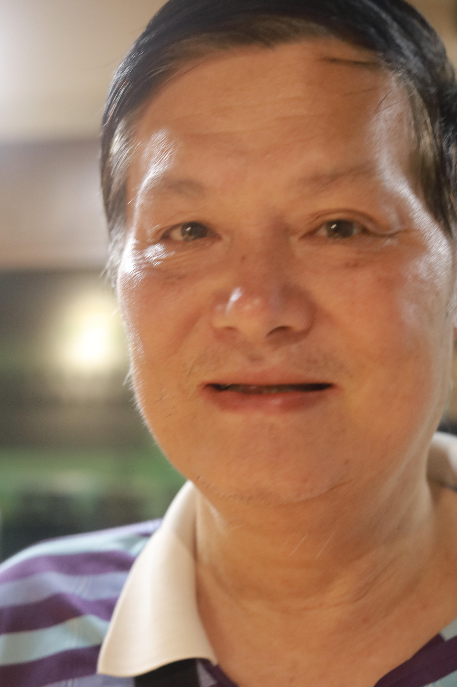

# 6月13日33人数据整理

## **1.数据的整体统计：**

### 原拍摄图片

+ 共**33**人，**411**张源图片
+ 图片分辨率：**4160*6240**

### 参数的设置

- 对齐方式：**FFHQ**
- 保存格式：**png**
- 最小人脸占比：**0.7**
- 模糊阈值：**70**

### 处理后的图片

+ 共**33**人

+ 采集得到**355**张高清人脸图，单人拍摄

+ 得到人脸图分辨率：**1024*1024**

### 本次数据的主要特点

+ 单人拍摄，效果较好
+ 但是**运动模糊**非常的严重，很多照片存在运动模糊的情况

## **2.以下几类问题的评判标准：**

- 颜色过暗：几乎无法辨认五官
- 遮挡面积过大：几乎遮挡了60%的五官
- 侧脸角度过大：侧脸超过90度
- **运动模糊：脸部不清晰，发丝部分出现重影**
- 单ID数据过少：同一个人的脸部数据小于等于2

## 3.数据集主要的问题的举例

### （1）运动模糊（只选取了部分）

#### 例1：IMG_2915.jpg

#### 例2：IMG_2933.jpg

#### 例3：IMG_2949.jpg

#### 例4：IMG_3011.jpg

#### 例5：IMG_3024.jpg

#### 例6：IMG_3056.jpg

#### 例7：IMG_3056.jpg

#### 例8：IMG_3105.jpg

#### 例9：IMG_3141.jpg

#### 例10：IMG_3159.png

#### 例11：IMG_3175.jpg

#### 例12：IMG_3219_jpg

#### 例13：IMG_3237.jpg

#### 例14：IMG_3252.jpg

#### 例15：IMG_3298.jpg

#### 例16：IMG_3357.jpg

#### 例17：IMG_3375.jpg

