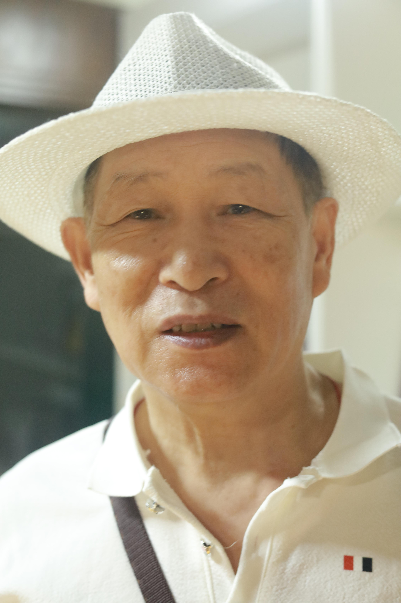
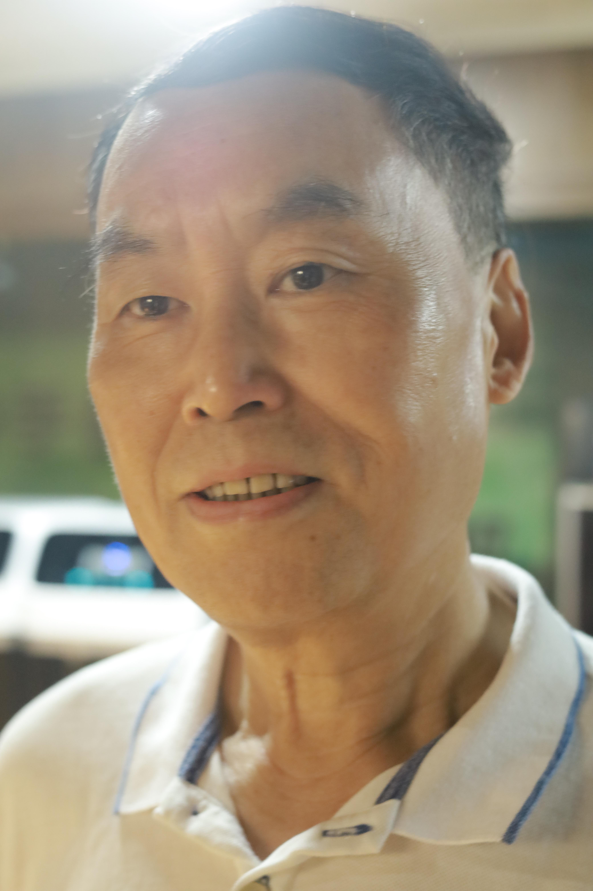
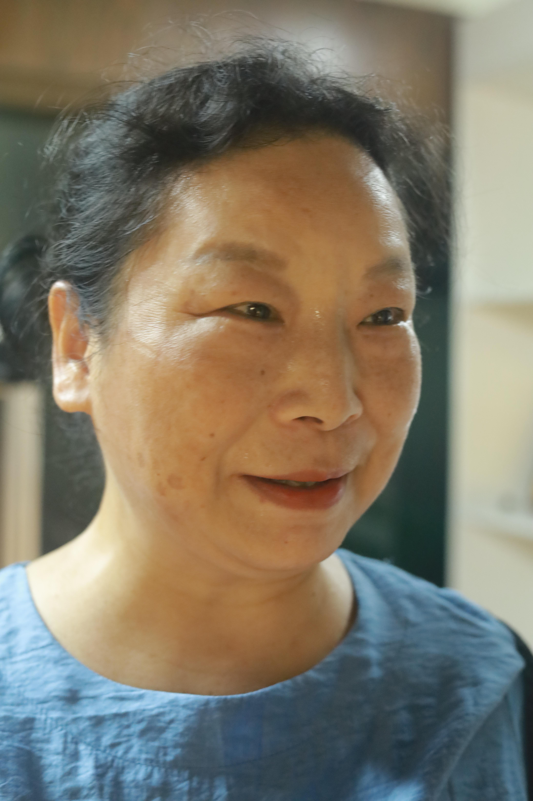
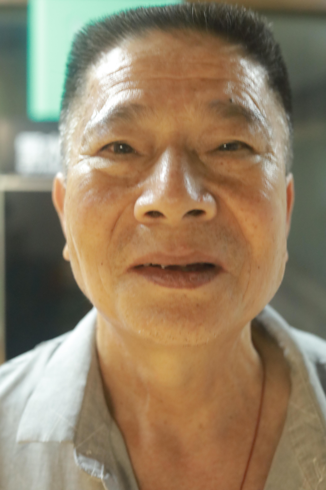
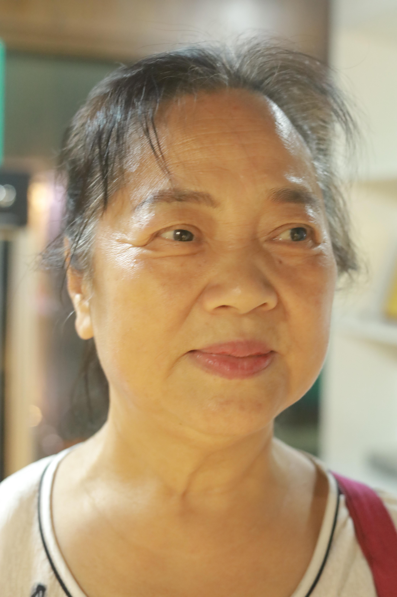
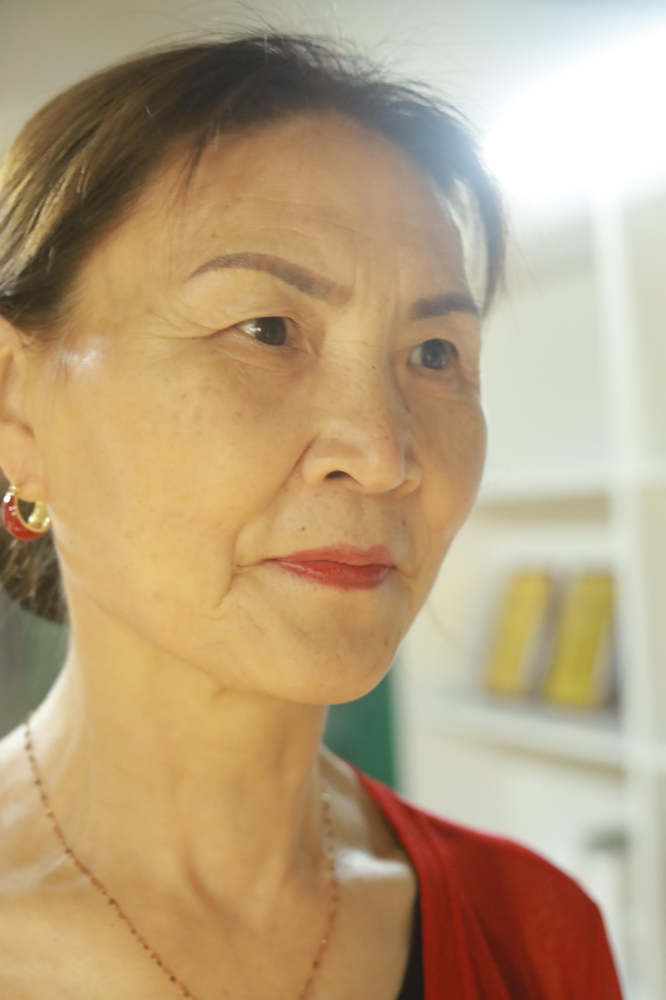

# 6月14日36人数据整理

## **1.数据的整体统计：**

### 原拍摄图片

+ 共**36**人，**682**张源图片
+ 图片分辨率：**4160*6240**

### 参数的设置

- 对齐方式：**FFHQ**
- 保存格式：**png**
- 最小人脸占比：**0.7**
- 模糊阈值：**70**

### 处理后的图片

+ 共**36**人

+ 采集得到**506**张高清人脸图，单人拍摄

+ 得到人脸图分辨率：**1024*1024**

### 本次数据的主要特点

+ 单人拍摄，效果较好
+ 但是**运动模糊**较为严重

## **2.以下几类问题的评判标准：**

- 颜色过暗：几乎无法辨认五官
- 遮挡面积过大：几乎遮挡了60%的五官
- 侧脸角度过大：侧脸超过90度
- **运动模糊：脸部不清晰，发丝部分出现重影**
- 单ID数据过少：同一个人的脸部数据小于等于2

## 3.数据集主要的问题的举例

### （1）运动模糊

#### 例1：IMG_2198.jpg

#### 例2：IMG_2218.jpg

#### 例3：IMG_2243.jpg

#### 例4：IMG_2269.jpg

#### 例5：IMG_2294.jpg

#### 例6：IMG_2345.jpg

#### 例7：IMG_2365.jpg

#### 例8：IMG_2391.jpg

#### 例9：IMG_2433.jpg

#### 例10：IMG_2455.jpg

#### 例11：IMG_2558.jpg

#### 例12：IMG_2089.jpg

