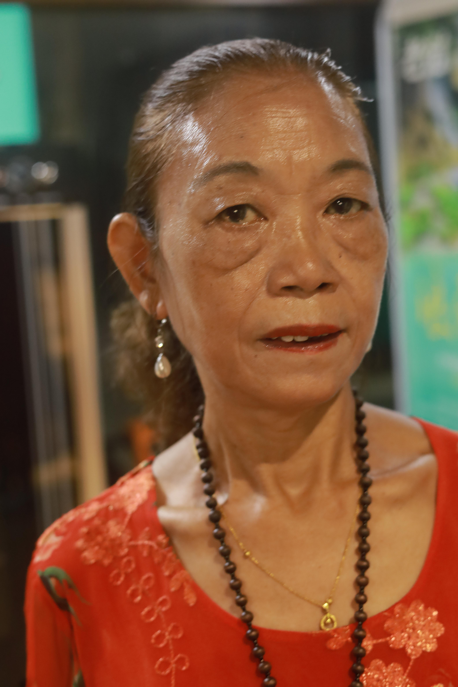
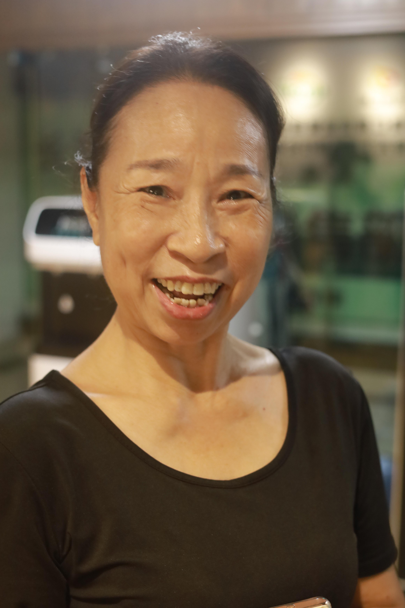
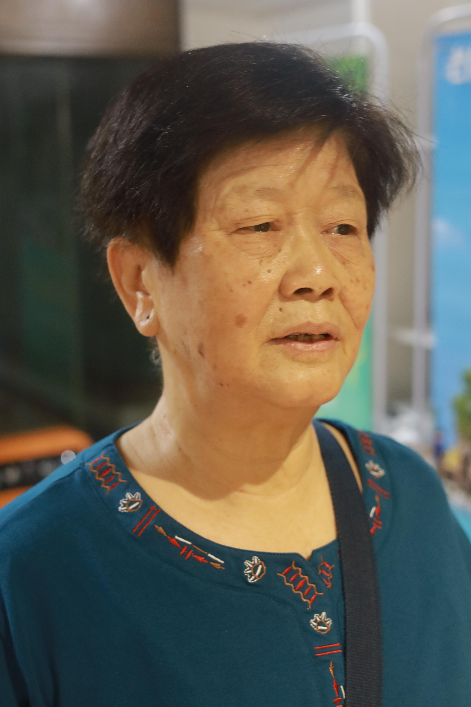
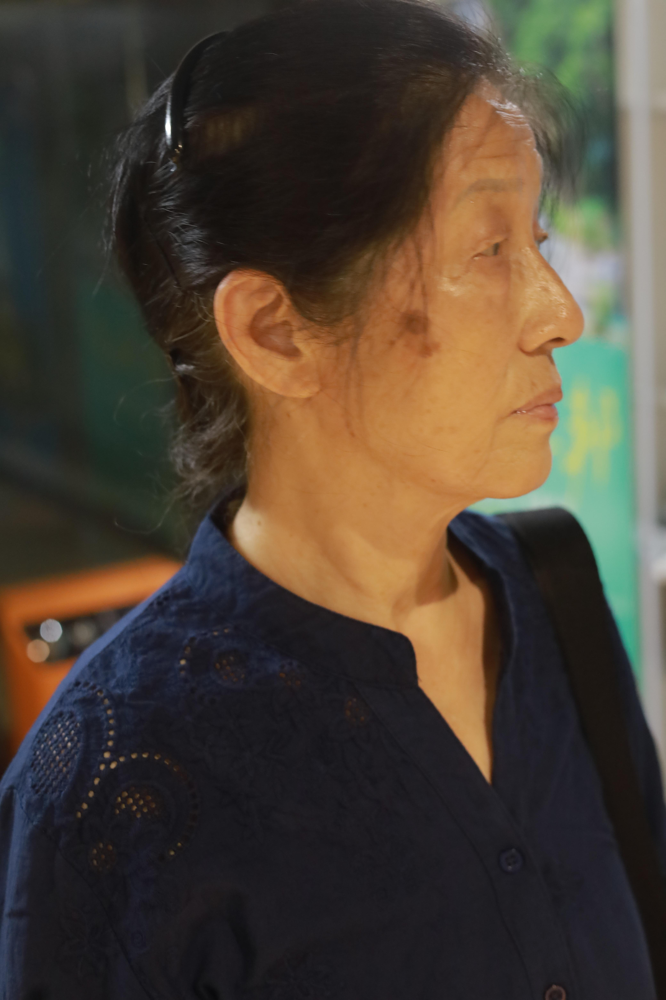
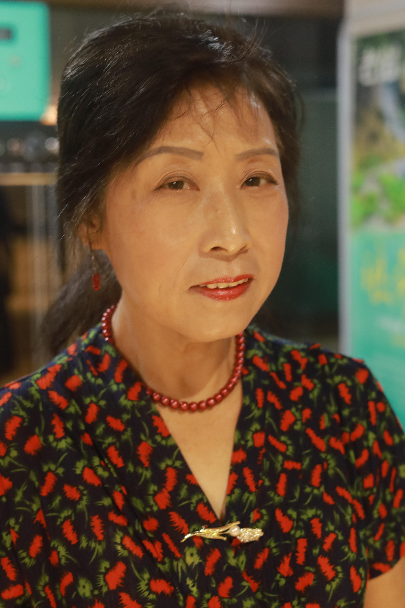
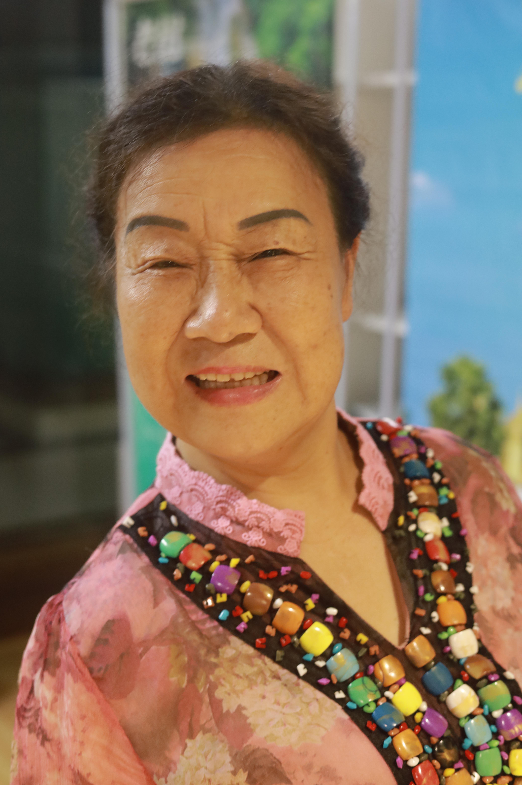

# 6月15日47人数据整理
 
## **1.数据的整体统计：**

### 原拍摄图片

- 共**47**人，**682**张源图片
- 图片分辨率：**4160\*6240**

### 参数的设置

- 对齐方式：**FFHQ**
- 保存格式：**png**
- 最小人脸占比：**0.7**
- 模糊阈值：**70**

### 处理后的图片

- 共**47**人
- 采集得到**622**张高清人脸图，单人拍摄
- 得到人脸图分辨率：**1024\*1024**

### 本次数据的主要特点

- 单人拍摄，效果较好
- **数据的整体质量较高，少量图片运动模糊**

## **2.以下几类问题的评判标准：**

- 颜色过暗：几乎无法辨认五官
- 遮挡面积过大：几乎遮挡了60%的五官
- 侧脸角度过大：侧脸超过90度
- **运动模糊：脸部不清晰，发丝部分出现重影**
- 单ID数据过少：同一个人的脸部数据小于等于2

## 3.数据集主要的问题的举例

### （1）运动模糊

#### 例1：IMG_3404.jpg

#### 例2：IMG_3538.jpg

#### 例3：IMG_3581.jpg

#### 例4：IMG_3583.jpg

#### 例5：IMG_3688.jpg

#### 例6：IMG_3816.jpg

#### 例7：IMG_3832.jpg

#### 例8：IMG_3858.jpg

#### 例9：IMG_3897.jpg

