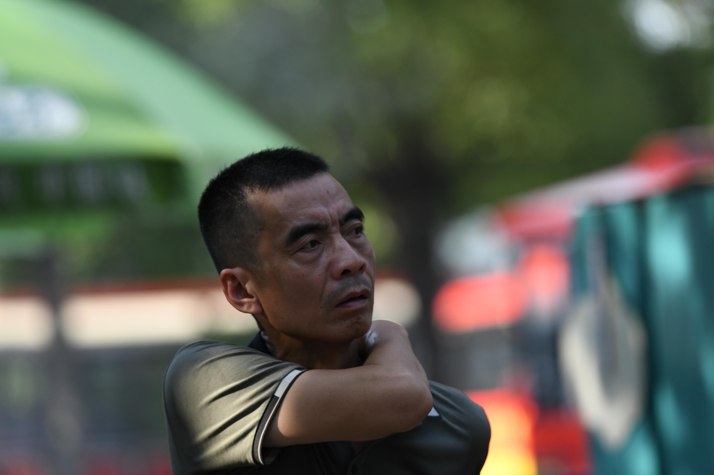
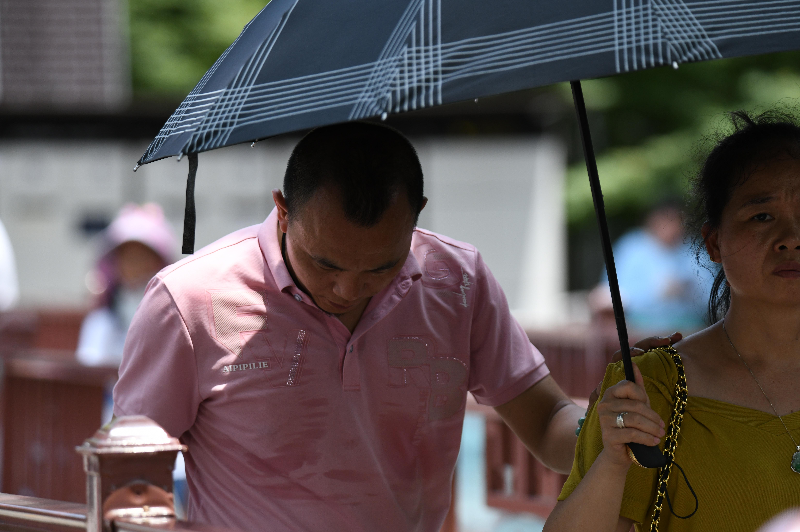

# 7月10日918人数据整理

## **1.数据的整体统计：**

### 原拍摄图片

- 共**918**人，**3990**张源图片
- 图片分辨率：**4160*6240**

### 参数的设置

- 对齐方式：**FFHQ**
- 保存格式：**png**
- 最小人脸占比：**0.7**
- 模糊阈值：**70**

### 处理后的图片

- 共**739**人
- 采集得到**2760**张高清人脸图，单人拍摄
- 得到人脸图分辨率：**1024\*1024**

### 本次数据的主要特点

- 

## **2.以下几类问题的评判标准：**

- 颜色过暗：几乎无法辨认五官
- 遮挡面积过大：几乎遮挡了60%的五官
- 侧脸角度过大：侧脸超过90度
- 运动模糊：脸部不清晰，发丝部分出现重影
- 单ID数据过少：同一个人的脸部数据小于等于2

## 3.数据集主要的问题的举例

### （1）运动模糊

#### 例1：DSC_0936.jpg

#### 例2：DSC_1146.jpg

#### 例3：DSC_1192.jpg

#### 例4：DSC_1415.jpg

#### 例5：DSC_1459.jpg

#### 例6：DSC_1465.jpg

#### 例7：DSC_1634.jpg

#### 例8：DSC_1718.jpg

#### 例9：DSC_1831.jpg

#### 例10：DSC_1909.jpg

#### 例11：DSC_1914.jpg

#### 例12：DSC_1976.jpg

#### 例13：DSC_2178.jpg

#### 例14：DSC_2335.jpg

#### 例15：DSC_2375.jpg

#### 例16：DSC_2447.jpg

#### 例17：DSC_2581.jpg

#### 例18：DSC_2747.jpg

#### 例19：DSC_2801.jpg

#### 例20：DSC_2889.jpg

#### 例21：DSC_2991.jpg

#### 例22：DSC_3203.jpg

#### 例23：DSC_3416.jpg

#### 例24：DSC_3552.jpg

#### 例25：DSC_3642.jpg

#### 例26：DSC_3852.jpg

#### 例27：DSC_4055.jpg

#### 例28：DSC_4074.jps

#### 例29：DSC_4135.jpg

#### 例30：DSC_4468.jpg

#### 例31：DSC_4543.jpg

#### 例32：DSC_4726.jpg

#### 例32：DSC_4936.jpg

#### 例1：DSC_1040.jpg

#### 例2：DSC_1056.jpg

#### 例3：DSC_4174.jpg

### （3）侧脸过大

#### 例1：DSC_1383.jpg

#### 例2：DSC_2849.jpg

#### 例3：DSC_3857.jpg

#### 例4：DSC_3993.jpg

#### 例5：DSC_4798.jpg

### （4）脸部过黑

#### 例1：DSC_2845.jpg

#### 例2：DSC_2936.jpg

#### 例3：DSC_3111.jpg

#### 例4：DSC_3195.jpg

#### 例5：DSC_4804.jpg

#### 例6：DSC_5025.jpg

#### 例7：DSC_5083.jpg

#### 例8：DSC_5126.jpg

#### 例9：DSC_5131.jpg

#### 例10：DSC_5140.jpg

