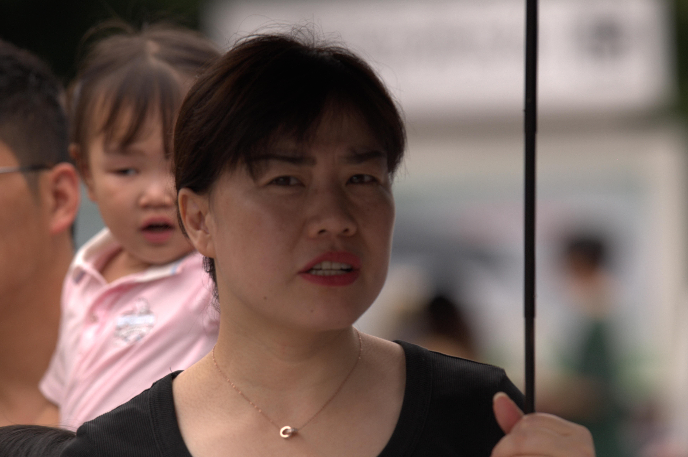
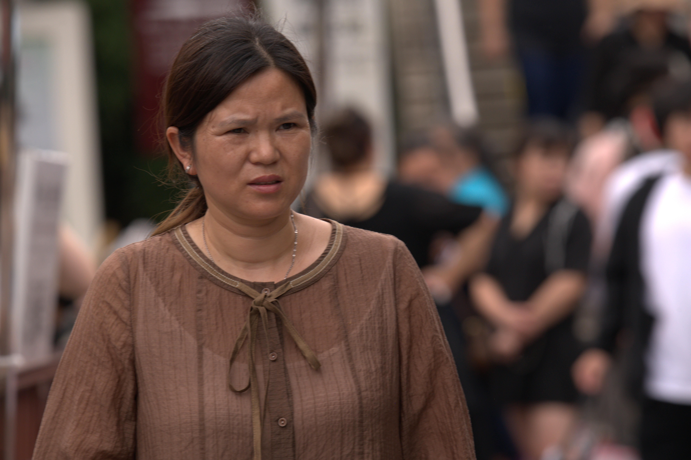
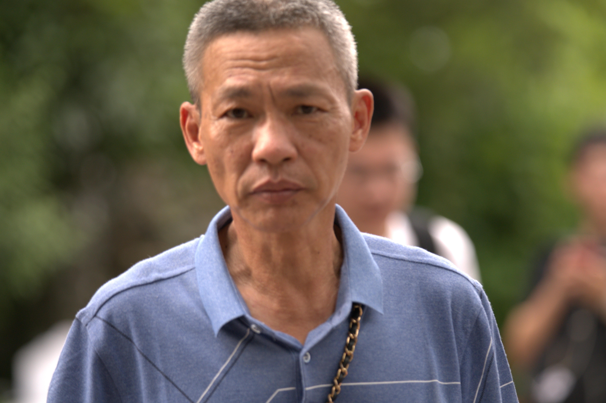
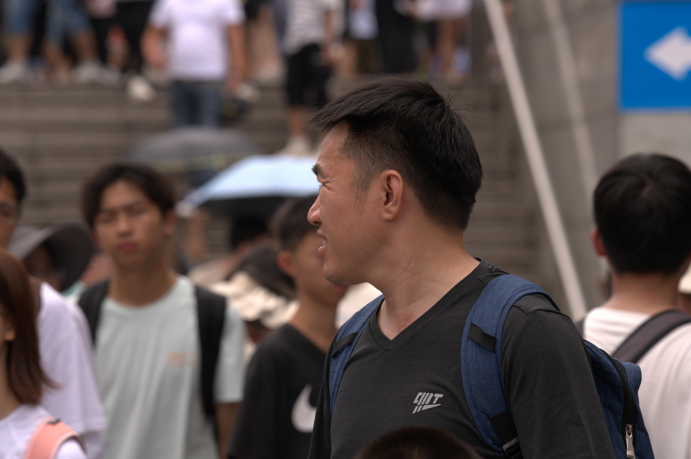

# 7月5日354人数据整理

## **1.数据的整体统计：** 

### 原拍摄图片

- 共**354**人，**1961**张源图片
- 图片分辨率：**4160*6240**

### 参数的设置

- 对齐方式：**FFHQ**
- 保存格式：**png**
- 最小人脸占比：**0.7**
- 模糊阈值：**70**

### 处理后的图片

- 共**33**人
- 采集得到**1185**张高清人脸图，单人拍摄
- 得到人脸图分辨率：**1024*1024**

### 本次数据的主要特点

- 运动模糊与失焦的情况

## **2.以下几类问题的评判标准：**

- 颜色过暗：几乎无法辨认五官
- 遮挡面积过大：几乎遮挡了60%的五官
- 侧脸角度过大：侧脸超过90度
- **运动模糊：脸部不清晰，发丝部分出现重影**
- 单ID数据过少：同一个人的脸部数据小于等于2

## 3.数据集主要的问题的举例

### （1）运动模糊

#### 例1：DSC_0026.jpg

#### 例2：DSC_0032.jpg

#### 例3：DSC_0062.jpg

#### 例4：DSC_0077.jpg

#### 例5：DSC_0092.jpg

#### 例6：DSC_0106.jpg

#### 例7：DSC_0115.jpg

#### 例8：DSC_0123.jpg

#### 例9：DSC_0259.jpg

#### 例11：DSC_0418.jpg

#### 例13：DSC_0540.jpg

#### 例14：DSC_0585.jpg

#### 例15：DSC_0652.jpg

#### 例16： DSC_0663.jpg

#### 例17：DSC_0678.jpg

#### 例18：DSC_0686.jpg

#### 例19：DSC_0763.jpg

#### 例20：DSC_0817.jpg

#### 例21：DSC_0865.jpg

#### 例22：DSC_1003.jpg

#### 例23：DSC_1173.jpg

#### 例24：DSC_1203.jpg

#### 例25：DSC_1225.jpg

#### 例26：DSC_1247.jpg

#### 例27：DSC_1292.jpg

#### 例28：DSC_1387.jpg

#### 例29：DSC_1563.jpg

#### 例28：DSC_1585.jpg

#### 例29：DSC_1614.jpg

#### 例30：DSC_1661.jpg

#### 例31：DSC_1691.jpg

#### 例32：DSC_1872.jpg

#### 例33：DSC_1889.jpg

#### 例34：DSC_1907.jpg

#### 例35：DSC_2274.jpg

#### 例36：DSC_2350.jpg

### （2）遮挡

#### 例1：DSC_2337.jpg

#### 例2：DSC_2657.jpg

#### 例3：DSC_9979.jpg

#### （3）侧脸角度过大

#### 例1：DSC_9827.jpg

#### 例2：DSC_9866.jpg

#### 例3：DSC_9912.jpg

#### 例4：DSC_0412.jpg

#### 例5：DSC_0458.jpg

