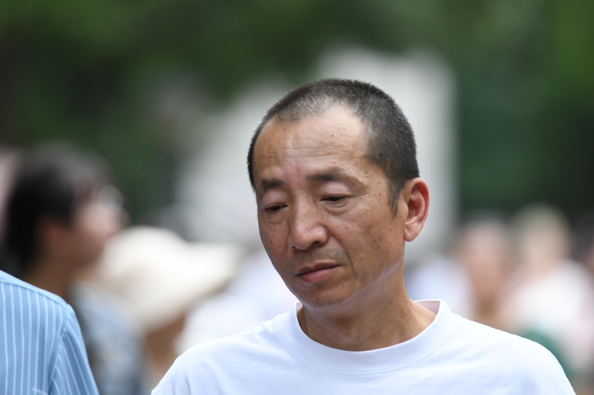
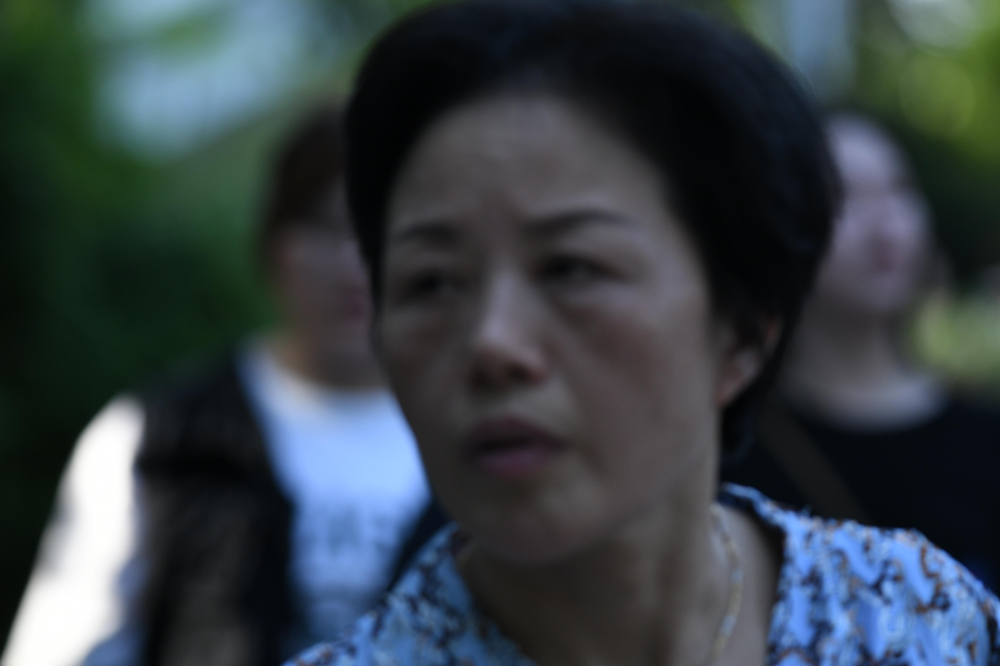
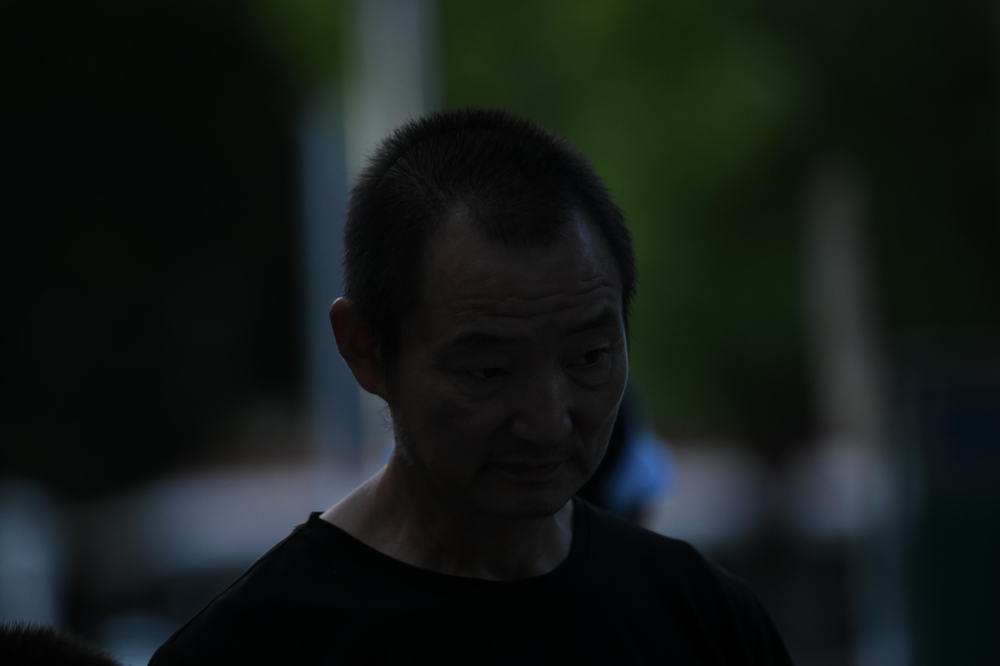

# 7月7日724人数据整理

## **1.数据的整体统计：**

### 原拍摄图片

- 共**724**人，**3847**张源图片
- 图片分辨率：**6192*4128**

### 参数的设置

- 对齐方式：**FFHQ**
- 保存格式：**png**
- 最小人脸占比：**0.7**
- 模糊阈值：**70**

### 处理后的图片

- 共**601**人
- 采集得到**2587**张高清人脸图（部分图片具有两个人脸）
- 得到人脸图分辨率：**1024\*1024**

### 本次数据的主要特点

- 单人拍摄，效果较好
- **运动模糊+部分天黑拍摄造成照片偏黑**

## **2.以下几类问题的评判标准：**

- 颜色过暗：几乎无法辨认五官
- 遮挡面积过大：几乎遮挡了60%的五官
- 侧脸角度过大：侧脸超过90度
- 运动模糊：脸部不清晰，发丝部分出现重影
- 单ID数据过少：同一个人的脸部数据小于等于2

## 3.数据集主要的问题的举例

### （1）运动模糊

#### 例1：DSC_2716.jpg

#### 例2：DSC_2749.jpg

#### 例3：DSC_2817.jpg

#### 例4：DSC_2820.jpg

#### 例5：DSC_2886.jpg

#### 例6：DSC_2865.jpg

#### 例7：DSC_3065.jpg

#### 例8：DSC_3111.jpg

#### 例9：DSC_3152.jpg

#### 例10：DSC_3389.jpg

#### 例11：DSC_3578.jpg

#### 例12：DSC_3594.jpg

#### 例13：DSC_3865.jpg

#### 例14：DSC_3963.jpg

#### 例15：DSC_4005.jpg

#### 例16：DSC_4113.jpg

#### 例17：DSC_4580.jpg

#### 例18：DSC_4596.jpg

#### 例19：DSC_4599.jpg

#### 例20：DSC_4644.jpg

#### 例21：DSC_4717.jpg

#### 例22：DSC_4738.jpg

#### 例23：DSC_4750.jpg

#### 例24：DSC_4760.jpg

#### 例25：DSC_4832.jpg

#### 例26：DSC_4866.jpg

#### 例27：DSC_4932.jpg

#### 例28：DSC_5022.jpg

#### 例29：DSC_5100.jpg

#### 例30：DSC_5179.jpg

#### 例31：DSC_5305.jpg

#### 例32：DSC_5328.jpg

#### 例33：DSC_5332.jpg

#### 例34：DSC_5367.jpg

#### 例35：DSC_5443.jpg

#### 例36：DSC_5544.jpg

#### 例37：DSC_5559.jpg

#### 例38：DSC_5584.jpg

#### 例39：DSC_6341.jpg

#### 例40：DSC_6480.jpg

### （2）侧脸过大

#### 例1：DSC_2752.jpg

#### 例2：DSC_2922.jpg

#### 例3：DSC_3039.jpg

#### 例4：DSC_4313.jpg

#### 例5：DSC_4634.jpg

#### 例6：DSC_5194.jpg

#### 例7：DSC_6537.jpg

### （3）遮挡过多

#### 例1：DSC_2825.jpg

#### 例2：DSC_2973.jpg

#### 例3：DSC_3032.jpg

#### 例4：DSC_3205.jpg

#### 例5：DSC_3222.jpg

#### 例6：DSC_3251.jpg

#### 例7：DSC_3261.jpg

#### 例8：DSC_3346.jpg

#### 例9：DSC_4021.jpg

#### 例10：DSC_4198.jpg

#### 例11：DSC_6102.jpg

#### 例12：DSC_6494.jpg

#### 例12：DSC_6602.jpg

### （4）背景过暗（有很多暗色的照片）

#### 例1：DSC_6643

