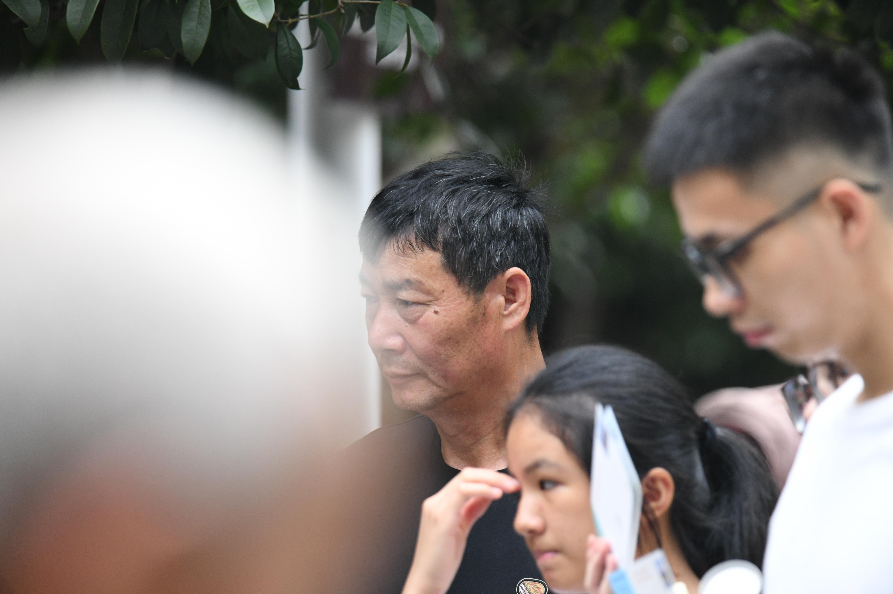

# 7月8日929人数据整理

## **1.数据的整体统计：** 

### 原拍摄图片

- 共**929**人，**3989**张源图片
- 图片分辨率：**6192*4128**

### 参数的设置

- 对齐方式：**FFHQ**
- 保存格式：**png**
- 最小人脸占比：**0.7**
- 模糊阈值：**70**

### 处理后的图片

- 共**912**人
- 采集得到**3562**张高清人脸图，单人拍摄
- 得到人脸图分辨率：**1024\*1024**

### 本次数据的主要特点

- 运动模糊与失焦的情况

## **2.以下几类问题的评判标准：**

- 颜色过暗：几乎无法辨认五官
- 遮挡面积过大：几乎遮挡了60%的五官
- 侧脸角度过大：侧脸超过90度
- **运动模糊：脸部不清晰，发丝部分出现重影**
- 单ID数据过少：同一个人的脸部数据小于等于2

## 3.数据集主要的问题的举例

### （1）运动模糊

#### 例1：DSC_0159.jpg

#### 例2：DSC_0442.jpg

#### 例3：DSC_0458.jpg

#### 例4：DSC_0552.jpg

#### 例5：DSC_0598.jpg

#### 例6：DSC_0645.jpg

#### 例7：DSC_0727.jpg

#### 例9：DSC_0810.jpg

#### 例10：DSC_0831

#### 例11：DSC_0838

#### 例12：DSC_7315.jpg

#### 例13：DSC_7355.jpg

#### 例14：DSC_7376.jpg

#### 例15：DSC_7393.jpg

#### 例16：DSC_7725.jpg

#### 例17：DSC_7841.jpg

#### 例18：DSC_8018.jpg

#### 例19：DSC_8208.jpg

#### 例20：DSC_8281.jpg

#### 例21：DSC_8350.jpg

#### 例22：DSC_8535.jpg

#### 例23：DSC_8793.jpg

#### 例24：DSC_8838.jpg

#### 例25：DSC_8885.jpg

#### 例26：DSC_8907.jpg

#### 例27：DSC_9040.jpg

#### 例28：DSC_9257.jpg

#### 例29：DSC_9380.jpg

### 

#### 例30：DSC_6618.jpg

### （2）严重遮挡

#### 例1：

#### 例2：DSC_6751.jpg

#### 例3：DSC_7475.jpg

#### 例4：DSC_7619.jpg

#### 例5：DSC_7944.jpg

#### 例6：DSC_8057.jpg

#### 例7：DSC_6602.jpg

### （3）侧脸超过90

#### 例1：DSC_6275

#### 例2：DSC_6798.jpg

#### 例3：DSC_6835.jpg

#### 例4：DSC_8397.jpg

#### 例5：DSC_6537.jpg

### （4）脸部过黑

例1：

#### 例2：DSC_6645.jpg

