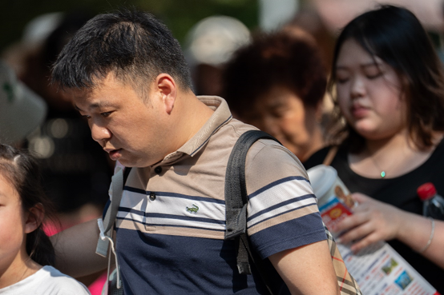
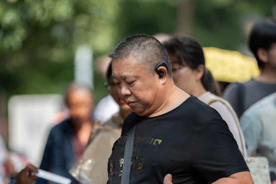
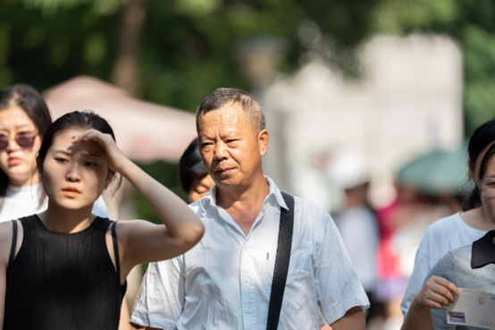
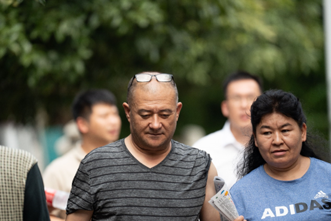
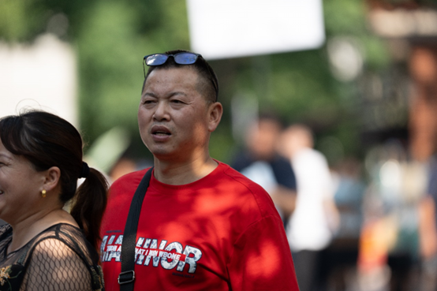
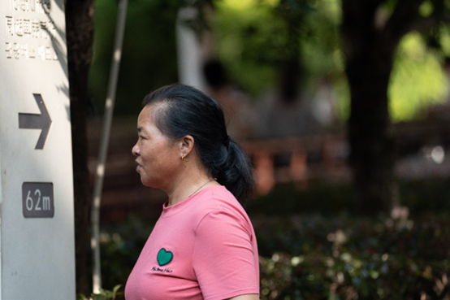
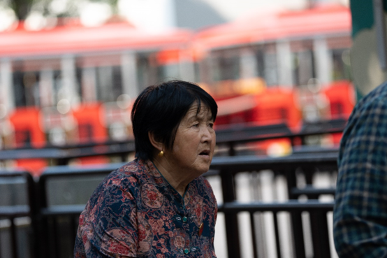
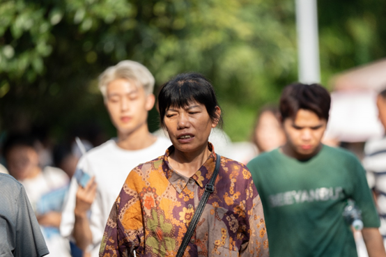

# 8月31日301人数据整理

## **1.数据的整体统计：**

### 原拍摄图片

+ 共572人，2285张源图片
+ 图片分辨率：7008*4672

### 参数的设置

- FFHQ裁剪的方式
- png图片保存
- min size选择0.7

### 处理后的图片

+ 采集得到2213张高清人脸图（部分图片有多张清晰人脸）

+ 得到人脸图分辨率：1024*1024

## **2.以下几类问题的评判标准：**

- 颜色过暗：几乎无法辨认五官
- 遮挡面积过大：几乎遮挡了60%的五官
- 侧脸角度过大：侧脸超过90度
- 运动模糊：脸部不清晰，发丝部分出现重影
- 单ID数据过少：同一个人的脸部数据小于等于2

## **3.数据集主要的问题的陈列**

### （1）运动模糊

#### **例1：DSC00907.jpg**

#### 例2：DSC00901.jpg

#### 例3：DSC00926.jpg

#### 例4：DSC01016.jpg

#### 例5： DSC01130.jpg

#### 例6： DSC01186.jpg

#### 例7：DSC01194.jpg

#### 例8： DSC01276.jpg

