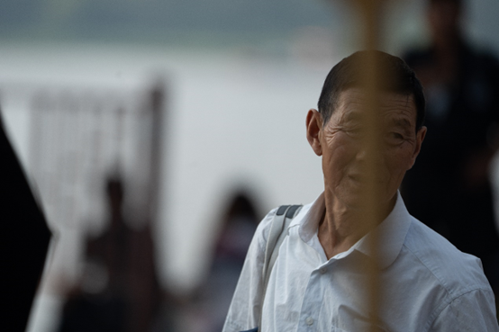

# 9月4日508人数据整理

## 1.数据的整体的统计

### 原拍摄图片

+ 共508人，2755张源图片
+ 图片分辨率：7008*4672

### 参数的设置

+ FFHQ裁剪的方式
+ png图片保存
+ min size选择0.7

### 处理后的图片

+ 采集得到2738张高清人脸图（部分图片有多张清晰人脸）
+ 得到人脸图分辨率：**1024*****1024**
+ **整体的数据质量好**

## 2.主要几类问题的评判标准

- 颜色过暗：几乎无法辨认五官
- 遮挡面积过大：几乎遮挡了60%的五官
- 侧脸角度过大：侧脸超过90度
- 运动模糊：脸部不清晰，发丝部分出现重影
- 单ID数据过少：同一个人的脸部数据小于等于2

## 3.数据集的主要问题陈列

### （1）侧脸的角度过大

**例1：DSC04741.jpg**

**例2：DSC04804.jpg**

**例3：DSC05007.jpg**

**例4：DSC05740.jpg**

**例5：DSC05749.jpg**

### （2）严重的遮挡

**例1：DSC05946.jpg**

**例2：DSC05356.jpg 遮挡**

**例3：DSC06503.jpg**

**例4：DSC06166**

### （3）运动模糊

**例1：**

**例2：DSC07191.jpg**

