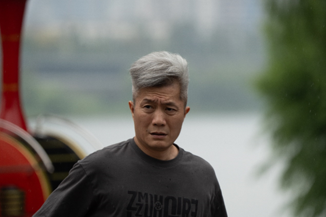
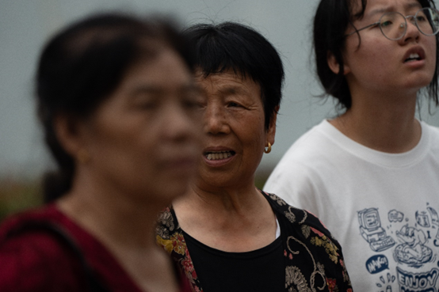

# 9月5日783人数据整理

## 1.数据的整体统计

### 原拍摄图片

+ 共**783**人，**3974**张源图片
+ 图片分辨率：**7008*4672**

### 参数的设置

+ FFHQ裁剪的方式
+ png图片保存
+ min size选择0.7

### 处理后的图片

+ 采集得到**3949**张高清人脸图（部分图片有多张清晰人脸）
+ 得到人脸图分辨率：1024*1024
+ 数据整体的主要问题是**运动模糊加光线较暗**（**雨天打伞较多，造成阴影过重**）

## 2.以下几类问题的评判标准 

- 颜色过暗：几乎无法辨认五官
- 遮挡面积过大：几乎遮挡了60%的五官
- 侧脸角度过大：侧脸超过90度
- 运动模糊：脸部不清晰，发丝部分出现重影
- 单ID数据过少：同一个人的脸部数据小于等于2

## 3.数据集主要问题的举例

### （1）运动模糊

#### **例1：DSC00577.jpg**

#### **例2：DSC00098.jpg**

#### **例3：DSC00356.jpg**

#### **例4：DSC00455.jpg**

#### **例5：DSC00606.jpg**

#### **例6：DSC00918.jpg**

#### **例7：**

#### **例8：DSC00223.jpg**

#### **例9：DSC00257.jpg**

#### **例10：DSC00261.jpg**

#### **例11：DSC00423.jpg**

#### 例12：DSC00564.jpg

#### 例13：DSC0095.jpg

#### 例14：DSC08179.jpg

#### 例15：DSC08604.jpg

#### 例16：DSC08624.jpg

#### 例17：DSC08691.jpg

#### 例18：DSC08792.jpg

### （2）侧脸的角度过大

#### 例1：DSC00718.jpg和DSC00719.jpg

#### 例2：DSC00604.jpg

#### 例3：DSC07883.jpg

### （3）颜色过暗

#### 例1：

#### 例2：DSC01078.jpg

#### 例3：DSC01340.jpg

### （4）遮挡严重

#### 例1：DSC01429.jpg

