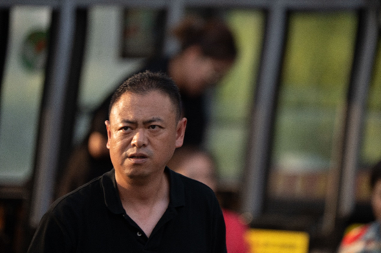
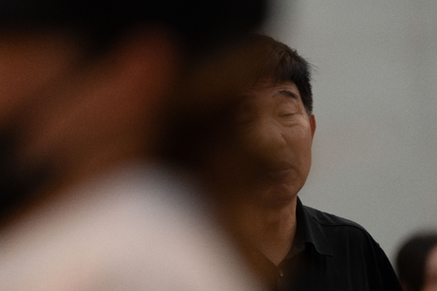

## 9月7日 572人数据整理  

## 1.数据的整体的统计

### 原拍摄图片

- 共**572**人，**2285**张源图片
- 图片分辨率：**7008*4672**

### 参数设置

- FFHQ裁剪的方式
- png图片保存
- min size选择0.7

### 处理后的图片

+ 采集得到**2213**张高清人脸图（部分图片有多张清晰人脸）

+ 得到人脸图分辨率：1024*1024
+ **数据集单ID数据过少的情况非常多** 

## 2.主要几类问题的评判标准

- 颜色过暗：几乎无法辨认五官
- 遮挡面积过大：几乎遮挡了60%的五官
- 侧脸角度过大：侧脸超过90度
- 运动模糊：脸部不清晰，发丝部分出现重影
- 单ID数据过少：同一个人的脸部数据小于等于2

## 3.数据的主要问题举例

### （1）单ID的数据过少（基本上只有单张图片）

> **例1：DSC03572.jpg**
>
> **例2：DSC03611.jpg**
>
> **例3：DSC03660.jpg**
>
> **例4：DSC03699.jpg**
>
> **例5：DSC04323.jpg** 
>
> **例6：DSC04438.jpg**
>
> **例7：DSC04637.jpg**
>
> **例8：DSC04659.jpg**
>
> **例9：DSC04679.jpg**
>
> **例10：DSC04909.jpg**
>
> **例11：DSC05008.jpg**
>
> **例12：DSC05014.jpg**

### （2）明显变形

#### 例：DSC04636.jpg

### （3）严重遮挡

#### 例： DSC04835.jpg

