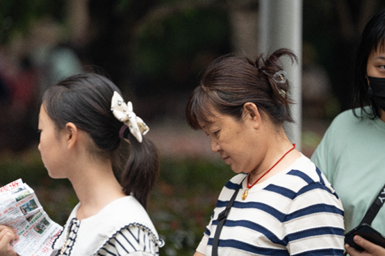

# 9月2日427人数据整理

## 1.数据整体统计

**原拍摄图片**

+ 共**427**人，**2732**张
+ 图片分辨率：**7008*****4672**

**参数设置**

+ FFHQ 裁剪方式
+ png 图片保存
+ min size选择0.7

**处理后的图片**

+ 采集得到2712张高清人脸图（部分图片有多张清晰人脸）

+ 得到人脸图分辨率：**1024*****1024**

## 2.主要几类问题的汇总

+ 颜色过暗：几乎无法辨认五官
+ 遮挡面积过大：几乎遮挡了60%的五官
+ 侧脸角度过大：侧脸超过90度
+ 运动模糊：脸部不清晰，发丝部分出现重影
+ 单ID数据过少：同一个人的脸部数据小于等于2

## 3.数据集的主要问题

### （1）颜色过暗

#### **例1：DSC01685.jpg** 

---

**例2：DSC03228.jpg**

---

**例3：DSC03293.jpg**

---

### **（2）严重失焦**

**例1：DSC02748.jpg**

----

### **（3）遮挡面积过大**   

  **例1：DSC02204.jpg**
  

---

**例2：DSC02956.jpg**

---

**例3：DSC03079.jpg**

---

**例4：DSC02530.jpg**

---

**例5：DSC04305.jpg**

---

**例6：DSC04304.jpg**

----

**例7：DSC03152.jpg**

---

### **（4）侧脸角度过大**

**例1：DSC03136.jpg**

---

### **（5）运动模糊**

**例1：DSC01974.jpg**

>

---

 **例2：DSC01970.jpg**

---

  **例3：DSC02021.jpg**
  

---

**例4：DSC01666.jpg**

---

**例5：DSC01698.jpg**

---

**例6：DSC01879.jpg**

---

**例7：DSC01885.jpg**

---

**例8：DSC01892.jpg**

---

**例9：DSC02748.jpg**

---

**例10：DSC02911.jpg**

---

**例11：DSC03174.jpg**

---

**例12：DSC03286.jpg**

### **（6）单个ID数据过少**

**例1：DSC03798.jpg（2张）**

---

